# Matomo-Web-Analytics-Project
Deploy Matomo Web Analytics on cloud

[Matomo](https://matomo.org/) is an open-source, self-hosted web analytics application written in [PHP](https://www.php.net/).

In this project you will install Matomo and a MariaDB database using Docker Compose, then install Nginx to act as a reverse proxy for the Matomo app

PROJECT STEPS
 
STEP 1- An Ubuntu 20.04 server with the UFW firewall enabled

STEP 2- Installing Docker

STEP 3- Docker Compose installed

STEP 4- Running Matomo and MariaDB with Docker Compose

STEP 5- Installing and Configuring Nginx

STEP 6- Installing Certbot and Setting Up SSL Certificates

STEP 7- Setting Up Matomo

     STEP 1 - AN UBUNTU 20.04 SERVER WITH THE UFW FIREWALL ENABLED
o. EC2 instace 

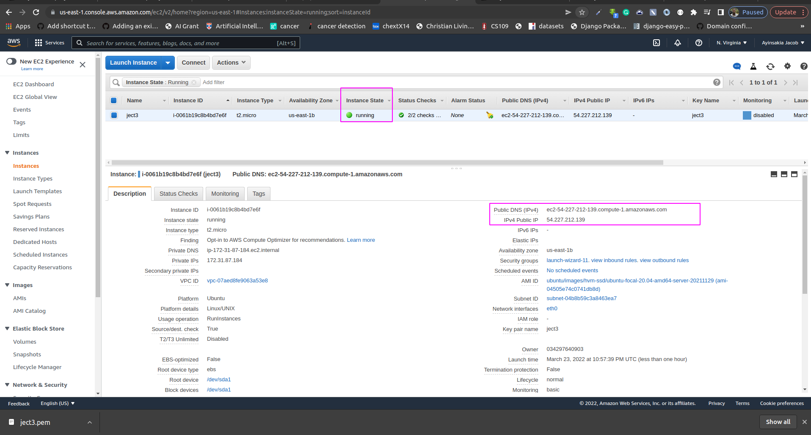
I. Logging in as root withn server, use this command;
$ sudo su

II. Create a new user with this command;
# adduser jasrael

III. Granting Administrative Privileges with this command 
usermod -aG sudo jasrael

IV.Setting Up a Basic Firewall with ; 
# ufw app list
this will be the output;
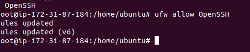

We need to make sure that the firewall allows SSH connections so that we can log back in next time. We can allow these connections by typing:
# ufw allow OpenSSH

Afterwards, we can enable the firewall by typing:
# ufw enable

Type yand press ENTERto proceed. You can see that SSH connections are still allowed by typing:
# ufw status
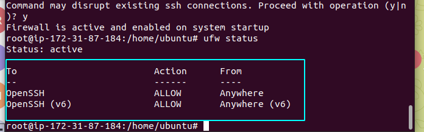

V.Enabling External Access for Your Regular User. If the root Account Uses Password Authentication.If you logged in to your root account using a password, then password authentication is enabled for SSH. You can SSH to your new user account by opening up a new terminal session and using SSH with your new username:
$ ssh sammy@your_server_public_ip

After entering your regular user’s password, you will be logged in. Remember, if you need to run a command with administrative privileges, type `sudo`before it like this:
$ sudo command_to_run

TROBLESHOOTING 

It is possible to receive an error message that says: Permission Denied (publickey). If you do not have this error, please skip ahead to the next section below. Otherwise, if you do have this error, then we can resolve it by modifying the configuration file. Use the following command in your Ubuntu server:
$ sudo nano /etc/ssh/sshd_config

Next, scroll through the file and make the following changes:

**Change `# PermitRootLogin prohibit-password` to the following:**

`# PermitRootLogin yes`

**Next, change `# PasswordAuthentication no` to the following:**

`# PasswordAuthentication yes` as seen in the image below;
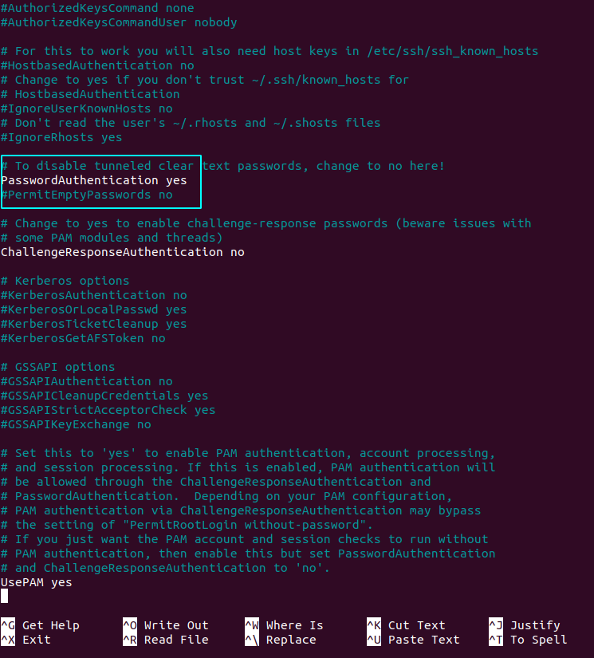

Once you have made these changes, save the file using `ctrl + O`, and then exit Nano using `ctrl + X`.

Next, restart the server by running the following command:

`$ sudo service ssh restart`

Now you should be able to SSH with your new username. Try this command again:

`$ ssh sammy@<your_server_public_ip>`

You will be prompted for your regular user password when using `sudo` for the first time each session (and periodically afterwards).

To enhance your server’s security, **we strongly recommend setting up SSH keys instead of using password authentication**.

HOW RO SET UP SSH KEYS ON A PC
SSH, or secure shell, is an encrypted protocol used to administer and communicate with servers. When working with an Ubuntu server, chances are you will spend most of your time in a terminal session connected to your server through SSH.

I.Creating the Key Pair with this command;
$ ssh-keygen 
This will be the output
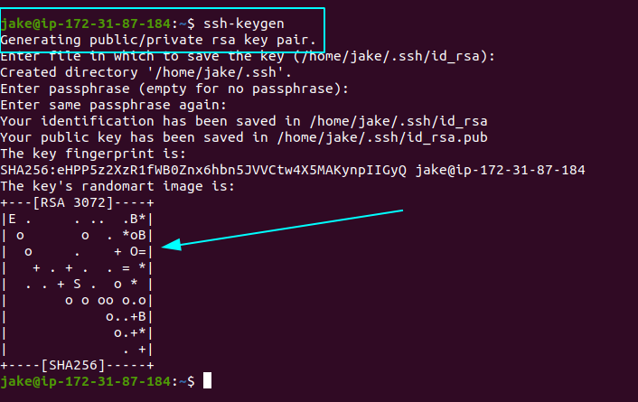

COPYING THE PUBLIC KEY USING ssh-copy-id

The `ssh-copy-id` tool is included by default in many operating systems, so you may have it available on your local system. For this method to work, you must already have password-based SSH access to your server.

To use the utility, you specify the remote host that you would like to connect to, and the user account that you have password-based SSH access to. This is the account to which your public SSH key will be copied.

The syntax is:

$ ssh-copy-id username@remote_host

You will see the following message:

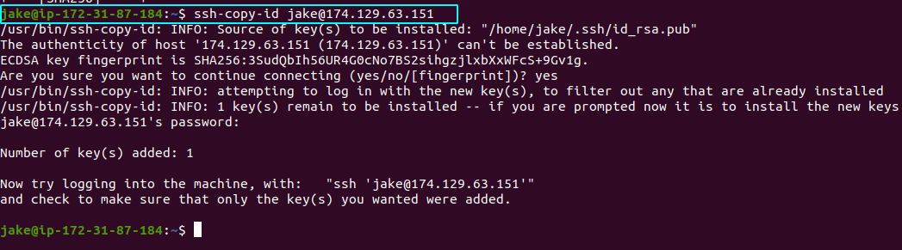

 

   AUTHENTICATING TO YOUR UBUNTU SERVER USING SSH KEYS

If you have successfully completed one of the procedures above, you should be able to log into the remote host *without* providing the remote account’s password.

The basic process is the same:
$ ssh username@remote_host

   DISABLING PASSWORD AUTHENTICATION ON YOUR SERVER 

 Once you’ve confirmed that your remote account has administrative privileges, log into your remote server with SSH keys, either as root or with an account with sudo privileges. Then, open up the SSH daemon’s configuration file:
$ sudo nano /etc/ssh/sshd_config

Inside the file, search for a directive called `PasswordAuthentication`. This line may be commented out with a `#` at the beginning of the line. Uncomment the line by removing the `#`, and set the value to `no`. This will disable your ability to log in via SSH using account passwords:

/etc/ssh/sshd_config
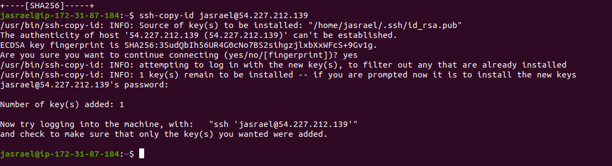

Save and close the file when you are finished by pressing CTRL+X, then Y to confirm saving the file, and finally ENTER to exit nano. To actually activate these changes, we need to restart the sshd service:
$ sudo systemctl restart ssh

As a precaution, open up a new terminal window and test that the SSH service is functioning correctly before closing your current session:
$  ssh username@remote_host

STEP 2 DOCKER INSTALLED
Docker is an application that simplifies the process of managing application processes in containers. Containers let you run your applications in resource-isolated processes. They’re similar to virtual machines, but containers are more portable, more resource-friendly, and more dependent on the host operating system.

I.First, update your existing list of packages:

$ sudo apt update

Next, install a few prerequisite packages which let apt use packages over HTTPS:

$ sudo apt install apt-transport-https ca-certificates curl software-properties-common

Then add the GPG key for the official Docker repository to your system:

$ curl -fsSL https://download.docker.com/linux/ubuntu/gpg | sudo apt-key add -

Then add the Docker repository to APT sources:
$ sudo add-apt-repository "deb [arch=amd64] https://download.docker.com/linux/ubuntufocal stable"

This will also update our package database with the Docker packages from the newly added repo.

Make sure you are about to install from the Docker repo instead of the default Ubuntu repo:

$ apt-cache policy docker-ce

You’ll see output like this, although the version number for Docker may be different:

Output of apt-cache policy docker-ce 

Notice that `docker-ce` is not installed, but the candidate for installation is from the Docker repository for Ubuntu 20.04 (`focal`).

Finally, install Docker:

$ sudo apt install docker-ce

Docker should now be installed, the daemon started, and the process enabled to start on boot. Check that it’s running:

$ sudo systemctl status docker

Installing Docker now gives you not just the Docker service (daemon) but also the docker command line utility, or the Docker client. We’ll explore how to use the docker command later in this tutorial.

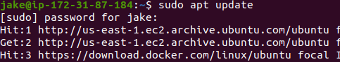

II. USING THE DOCKER COMMAND
Using docker consists of passing it a chain of options and commands followed by arguments. The syntax takes this form:

$ docker [option] [command] [arguments]

To view all available subcommands, type:

$ docker

To view the options available to a specific command, type:

$ dockerdocker-subcommand --help

To view system-wide information about Docker, use:

$ docker info

IV.WORKING WITH DOCKER IMAGES

Docker containers are built from Docker images. By default, Docker pulls these images from [Docker Hub](https://hub.docker.com/), a Docker registry managed by Docker, the company behind the Docker project. Anyone can host their Docker images on Docker Hub, so most applications and Linux distributions you’ll need will have images hosted there.

To check whether you can access and download images from Docker Hub, type:

$ docker run hello-world

You can search for images available on Docker Hub by using the docker command with the search subcommand. For example, to search for the Ubuntu image, type

$ docker search ubuntu

In the **OFFICIAL** column, **OK** indicates an image built and supported by the company behind the project. Once you’ve identified the image that you would like to use, you can download it to your computer using the `pull` subcommand.

Execute the following command to download the official `ubuntu` image to your computer:

$ docker pull ubuntu

To see the images that have been downloaded to your computer, type:

$ docker images

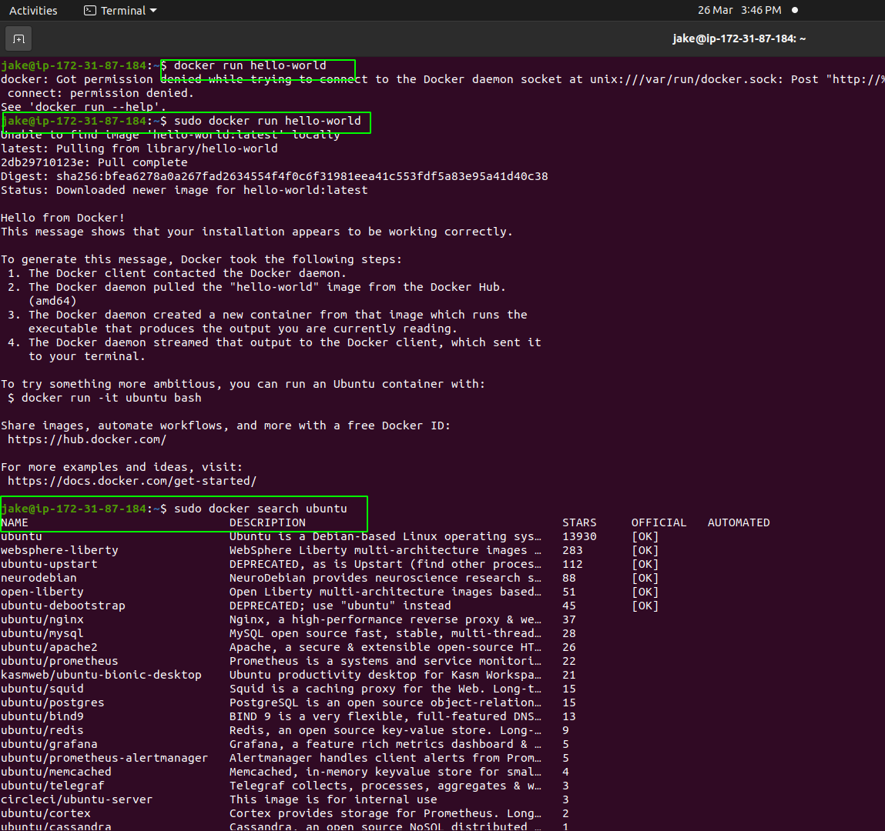

V. MANAGING DOCKER CONTAINERS
After using Docker for a while, you’ll have many active (running) and inactive containers on your computer. To view the **active ones**, use:

$ docker ps

In this project, you started two containers; one from the `hello-world` image and another from the `ubuntu` image. Both containers are no longer running, but they still exist on your system.

To view all containers — active and inactive, run `docker ps` with the `-a` switch:

$ docker ps -a

To view the latest container you created, pass it the -l switch:

$ docker ps -i

To start a stopped container, use docker start, followed by the container ID or the container’s name. Let’s start the Ubuntu-based container with the ID of 1c08a7a0d0e4:

$ docker start1c08a7a0d0e4

The container will start, and you can use `docker ps` to see its status:

To stop a running container, use docker stop, followed by the container ID or name. This time, we’ll use the name that Docker assigned the container, which is quizzical_mcnulty:

$ docker stop quizzical_mcnulty

Once you’ve decided you no longer need a container anymore, remove it with the docker rm command, again using either the container ID or the name. Use the docker ps -a command to find the container ID or name for the container associated with the hello-world image and remove it

$ docker rm youthful_curie

You can start a new container and give it a name using the `--name` switch. You can also use the `--rm` switch to create a container that removes itself when it’s stopped. See the `docker run help` command for more information on these options and others.

Containers can be turned into images which you can use to build new containers. Let’s look at how that works.

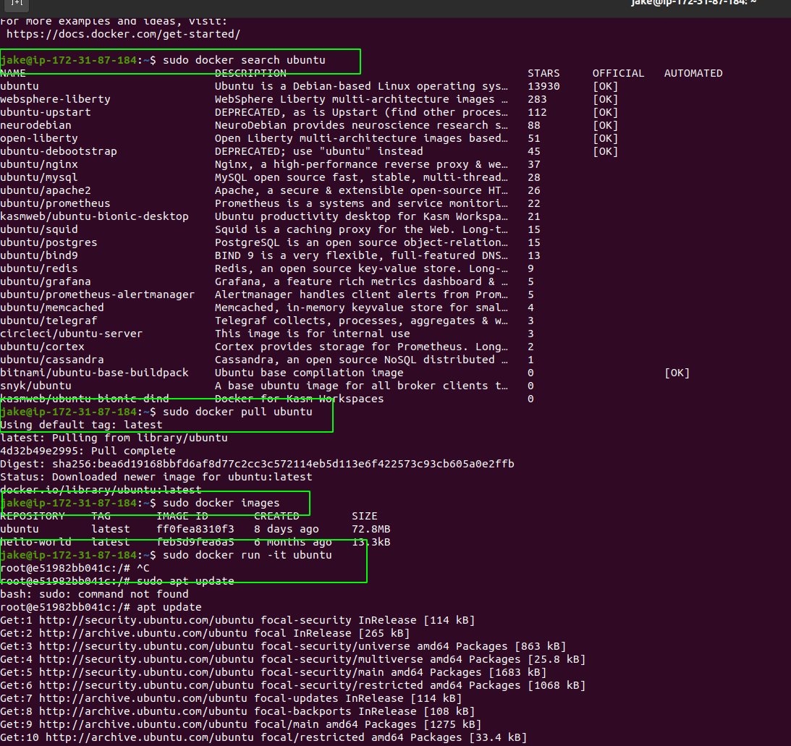
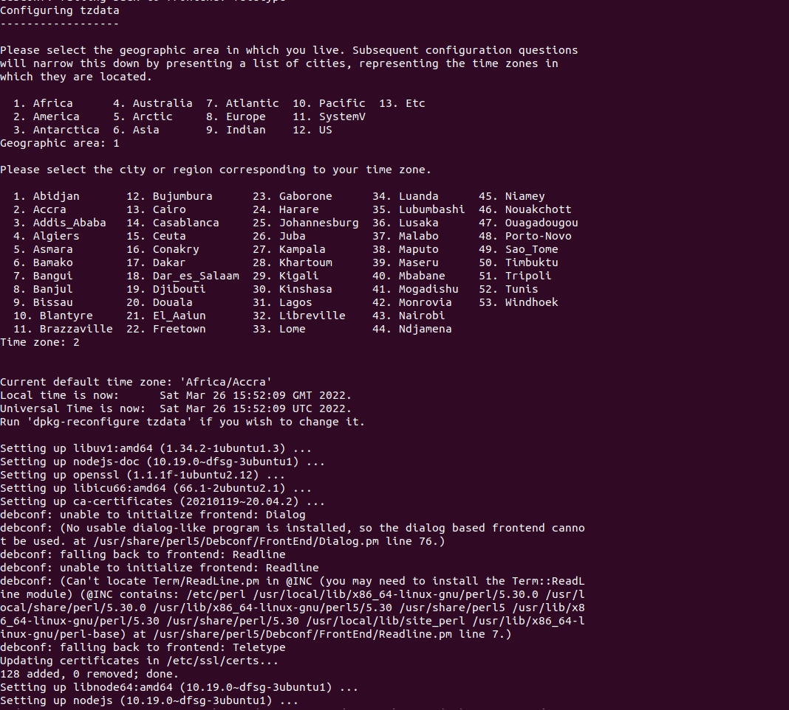
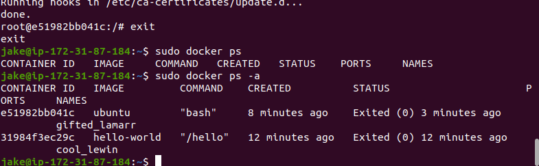

VI. COMMITTING CHANGES IN A CONTAINER TO A DOCKER IMAGE

When you start up a Docker image, you can create, modify, and delete files just like you can with a virtual machine. The changes that you make will only apply to that container. You can start and stop it, but once you destroy it with the `docker rm` command, the changes will be lost for good.

This section shows you how to save the state of a container as a new Docker image.

After installing Node.js inside the Ubuntu container, you now have a container running off an image, but the container is different from the image you used to create it. But you might want to reuse this Node.js container as the basis for new images later.

Then commit the changes to a new Docker image instance using the following command.

$ docker commit -m "What you did to the image" -a "Author Name"container_idrepository/new_image_name

The **-m** switch is for the commit message that helps you and others know what changes you made, while **-a** is used to specify the author. The `container_id` is the one you noted earlier in the tutorial when you started the interactive Docker session. Unless you created additional repositories on Docker Hub, the `repository` is usually your Docker Hub username.

$ docker commit -m "added Node.js" -a "sammy" d 9b100f2f636 sammy/ubuntu-nodejs

When you *commit* an image, the new image is saved locally on your computer. Later in this tutorial, you’ll learn how to push an image to a Docker registry like Docker Hub so others can access it.

Listing the Docker images again will show the new image, as well as the old one that it was derived from:

$ docker images
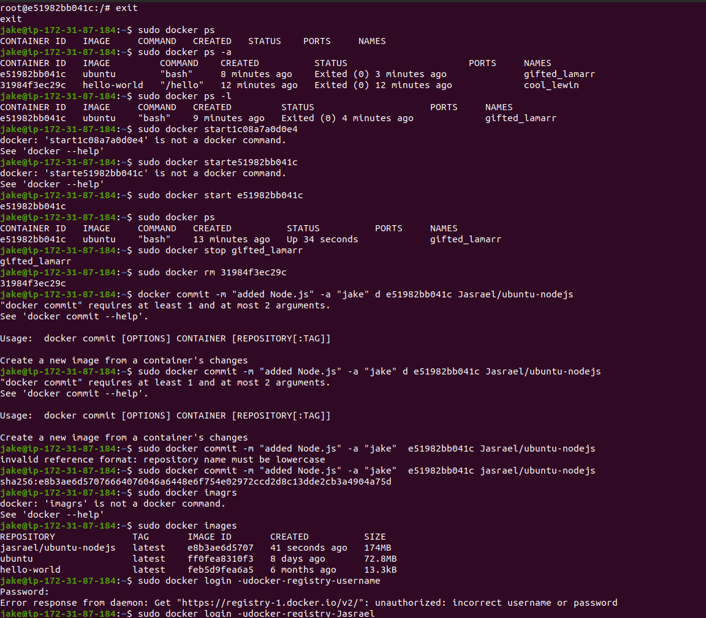

VII. PUSHING DOCKER IMAGES TO A DOCKER REPOSITORY 

The next logical step after creating a new image from an existing image is to share it with a select few of your friends, the whole world on Docker Hub, or other Docker registry that you have access to. To push an image to Docker Hub or any other Docker registry, you must have an account there.
To push your image, first log into Docker Hub.

docker login -udocker-registry-username

If your Docker registry username is different from the local username you used to create the image, you will have to tag your image with your registry username. For the example given in the last step, you would type:

$ docker tag sammy/ubuntu-nodejs docker-registry-username/ubuntu-nodejs

Then you may push your own image using:
$ docker pushdocker-registry-username/docker-image-name

To push the ubuntu-nodejs image to the jasrael repository, the command would be:

docker push jasrael/ubuntu-nodejs

After pushing an image to a registry, it should be listed on your account’s dashboard, like that show in the image below.
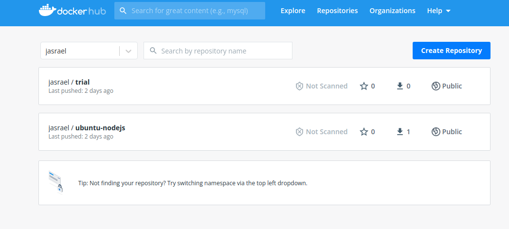

STEP  3  DOCKER COMPOSED INSTALLED

## 3. Docker Compose installed.

Docker simplifies the process of managing application processes in containers. While containers are similar to virtual machines in certain ways, they are more lightweight and resource-friendly. This allows developers to break down an application environment into multiple isolated services.

For applications depending on several services, orchestrating all the containers to start up, communicate, and shut down together can quickly become unwieldy. [Docker Compose](https://docs.docker.com/compose/) is a tool that allows you to run multi-container application environments based on definitions set in a YAML file. It uses service definitions to build fully customizable environments with multiple containers that can share networks and data volumes.

In this guide, we’ll demonstrate how to install Docker Compose on an Ubuntu 20.04 server and how to get started using this tool.

### Prerequisites

You will need:

- Access to an Ubuntu 20.04 local machine or development server as a non-root user with sudo privileges. If you’re using a remote server, it’s advisable to have an active firewall installed.
- Docker installed on your server or local machine

I. To make sure we obtain the most updated stable version of Docker Compose, we’ll download this software from its [official Github repository](https://github.com/docker/compose).

First, confirm the latest version available in their [releases page](https://github.com/docker/compose/releases). At the time of this writing, the most current stable version is `1.27.4`.

II. The following command will download the `1.27.4` release and save the executable file at `/usr/local/bin/docker-compose`, which will make this software globally accessible as `docker-compose`:

$ sudo curl -L "https://github.com/docker/compose/releases/download/1.27.4/docker-compose-$(uname -s)-$(uname -m)" -o /usr/local/bin/docker-compose

III. Next, set the correct permissions so that the docker-compose command is executable:

$ sudo chmod +x /usr/local/bin/docker-compose

IV. To verify that the installation was successful, you can run:

$ docker-compose --version

 SETTING UP A docker-compose.yml FILE

To demonstrate how to set up a docker-compose.yml file and work with Docker Compose, we’ll create a web server environment using the official Nginx image from Docker Hub, the public Docker registry. This containerized environment will serve a single static HTML file.

I. Start off by creating a new directory in your home folder, and then moving into it:

$ mkdir ~/compose-demo
cd ~/compose-demo

II.In this directory, set up an application folder to serve as the document root for your Nginx environment:

$ mkdir app

III. Using your preferred text editor, create a new index.html file within the app folder:
$ nano app/index.html

IV. Place the following content into this file: 

<!doctype html>
<html lang="en">
<head>
    <meta charset="utf-8">
    <title>Docker Compose Demo</title>
    <link rel="stylesheet" href="https://cdn.jsdelivr.net/gh/kognise/water.css@latest/dist/dark.min.css">
</head>
<body>

	<h1>This is a Docker Compose Demo Page.</h1>
	
This content is being served by an Nginx container.

</body>
</html>

Save and close the file when you’re done. If you are using `nano`, you can do that by typing `CTRL+X`, then `Y` and `ENTER` to confirm.

IV. Next, create the docker-compose.yml file:

$ nano docker-compose.yml

 RUNNING DOCKER COMPOSE 

With the docker-compose.yml file in place, we can now execute Docker Compose to bring our environment up. The following command will download the necessary Docker images, create a container for the web service, and run the containerized environment in background mode:

$ docker-compose up -d

II. Your environment is now up and running in the background. To verify that the container is active, you can run:

$ docker-compose ps

III.You can now access the demo application by pointing your browser to either localhost:8000 if you are running this demo on your local machine, or your_server_domain_or_IP:8000 if you are running this demo on a remote server.

  GETTING FAMILAR WITH DOCKER COMPOSE COMMANDS

I.You’ve seen how to set up a docker-compose.yml file and bring your environment up with docker-compose up. You’ll now see how to use Docker Compose commands to manage and interact with your containerized environment.

$ docker-compose logs

II. If you want to pause the environment execution without changing the current state of your containers, you can use:

$ docker-compose pause

III. To resume execution after issuing a pause:

$ docker-compose unpause

The stop command will terminate the container execution, but it won’t destroy any data associated with your containers:

$ docker-compose stop

IV.If you want to remove the containers, networks, and volumes associated with this containerized environment, use the down command:

$ docker-compose down

 Notice that this won’t remove the base image used by Docker Compose to spin up your environment (in our case, `nginx:alpine`). This way, whenever you bring your environment up again with a `docker-compose up`, the process will be much faster since the image is already on your system.

V. In case you want to also remove the base image from your system, you can use:

$ docker image rm nginx:alpine

 
    STEP 4 RUNNING MATOMO AND MARIADB WITH DOCKER

I. Your first step will be to create the Docker Compose configuration that will launch containers for both the Matomo app and a MariaDB database.

This section will put your configuration inside a `matomo` directory in your home directory. You could also choose to work in an `/opt/matomo` directory or some other directory of your choosing.

First ensure you’re in your home directory:

cd ~

II. Then create the matomo directory and cd into it:

mkdir matomo
cd matomo

III. Now open a new blank YAML file called docker-compose.yml:

nano docker-compose.yml

IV. When that’s done, Matomo should be running. You can test that a webserver is running at localhost:8080 by fetching the homepage using the curl command:
curl --head http://localhost:8080

    STEP 5  INSTALLING AND CONFIGURING NGINX.

Putting a web server such as Nginx in front of your Matomo server can improve performance by offloading caching, compression, and static file serving to a more efficient process. We’re going to install Nginx and configure it to *[reverse proxy](https://www.digitalocean.com/community/tutorials/understanding-nginx-http-proxying-load-balancing-buffering-and-caching)* requests to Matomo, meaning it will take care of handing requests from your users to Matomo and back again. Using a non-containerized Nginx will also make it easier to add Let’s Encrypt SSL certificates in the next step.

First, refresh your package list, then install Nginx using `apt`:

sudo apt update
sudo apt install nginx

II. Allow public traffic to ports 80 and 443 (HTTP and HTTPS) using the “Nginx Full” UFW application profile:

sudo ufw allow "Nginx Full"

III. Next, open up a new Nginx configuration file in the `/etc/nginx/sites-available` directory. We’ll call ours `matomo.conf` but you could use a different name:

sudo nano /etc/nginx/sites-available/matomo.conf

IV. Paste the following into the new configuration file, being sure to replace `your_domain_here` with the domain that you’ve configured to point to your Matomo server. This should be something like `matomo.example.com`, for instance:

/etc/nginx/sites-available/matomo.conf

Save and close the file, then enable the configuration by linking it into `/etc/nginx/sites-enabled/`:
sudo ln -s /etc/nginx/sites-available/matomo.conf /etc/nginx/sites-enabled/

V. Use nginx -t to verify that the configuration file syntax is correct:

sudo nginx -t

VI. And finally, reload the nginx service to pick up the new configuration:

sudo systemctl reload nginx

Your Matomo site should now be available on plain HTTP. Load http://your_domain_here (you may have to click through a security warning) and it will look like this:

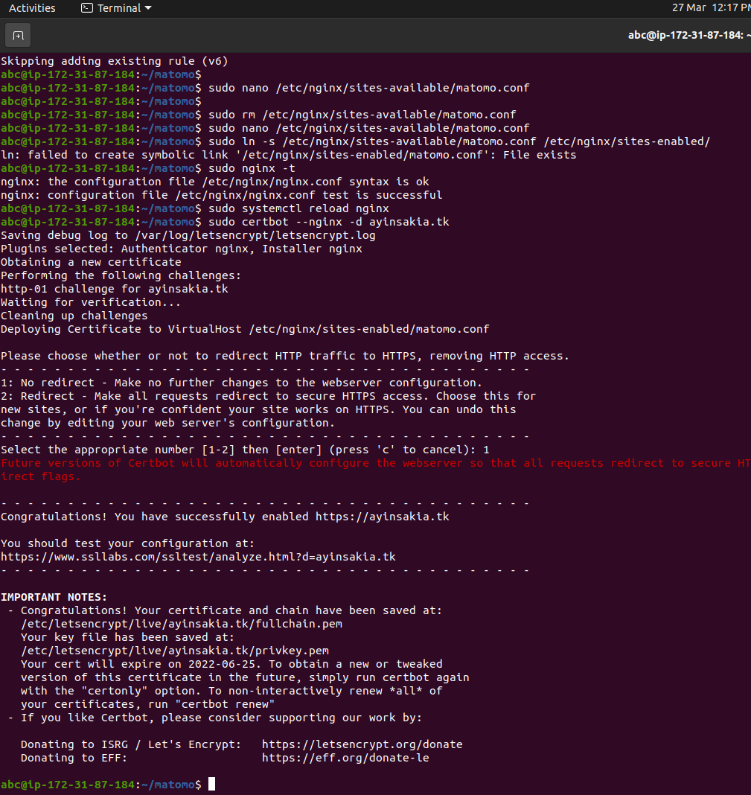

 STEP 3 INSTALLING CERTBOT AND SETTING UP SSL CERTICATES

Thanks to Certbot and the Let’s Encrypt free certificate authority, adding SSL encryption to our Matomo app will take only two commands.

I. First, install Certbot and its Nginx plugin:

sudo apt install certbot python3-certbot-nginx

II.Next, run certbot in --nginx mode, and specify the same domain you used in the Nginx server_name config:

sudo certbot --nginx -dyour_domain_here

You’ll be prompted to agree to the Let’s Encrypt terms of service, and to enter an email address.

Afterwards, you’ll be asked if you want to redirect all HTTP traffic to HTTPS. It’s up to you, but this is generally recommended and safe to do.

After that, Let’s Encrypt will confirm your request and Certbot will download your certificate:
 

  STEP 6 SETTING UP MATOMO

Back in your web browser you should now have Matomo’s **Welcome!** page open via a secure `https://` connection. Now you can enter usernames and passwords safely to complete the installation process.

Click the **Next** button. You’ll be taken to the **System Check** step:

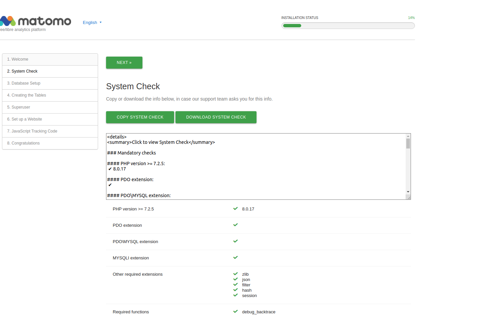

This is a summary of the system Matomo is running on, and everything should be green checkmarks indicating there are no problems. Scroll all the way to the bottom and click the **Next** button.

Now you’ll be on the **Database Setup** page:

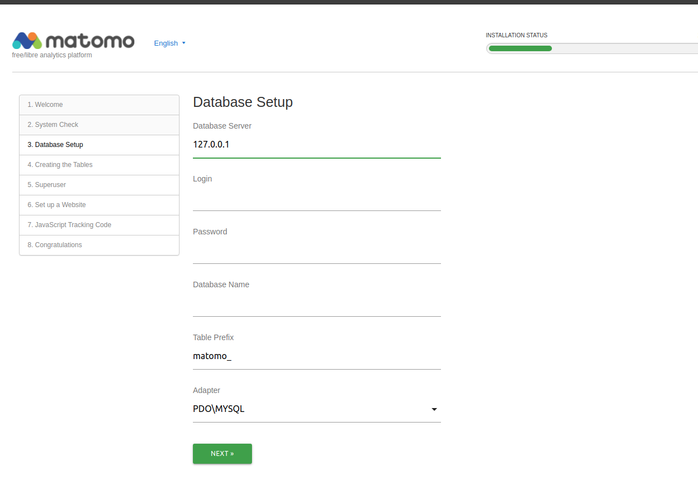

The information you fill in on this page will tell the Matomo application how to connect to the MariaDB database. You’ll need the `MARIADB_USER` and `MARIADB_PASSWORD` that you chose in Step 1. You can copy them out of your `.env` file if you need to.

Fill out the first four fields:

- **Database Server:** db
- **Login:** the username you set in the `MARIADB_USER` environment variable
- **Password:** the password you set in the `MARIADB_PASSWORD` environment variable
- **Database Name:** matomo

The defaults are fine for the remaining two fields.

Click **Next** once more. You’ll get a confirmation that the database was set up correctly. Click **Next** again. You’ll then need to set up an admin user, and finally you’ll set up information about the first website you want to collect analytics for.

After all that, you should end up on step 8, a **Congratulations** page. You’re almost all done. Scroll down to the bottom and click the **Continue to Matomo** button, and you’ll be taken to the homepage:

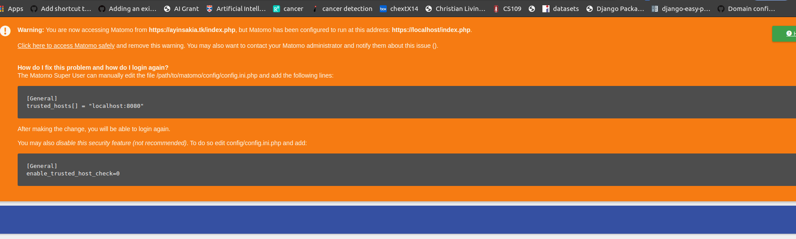

These options let Matomo know that it’s safe to use port `8080`, and that it should assume it’s always being accessed over a secure connection.

Save and close the configuration file, then switch back to your browser and reload the page. The error should be gone, and you’ll be presented with a login prompt:

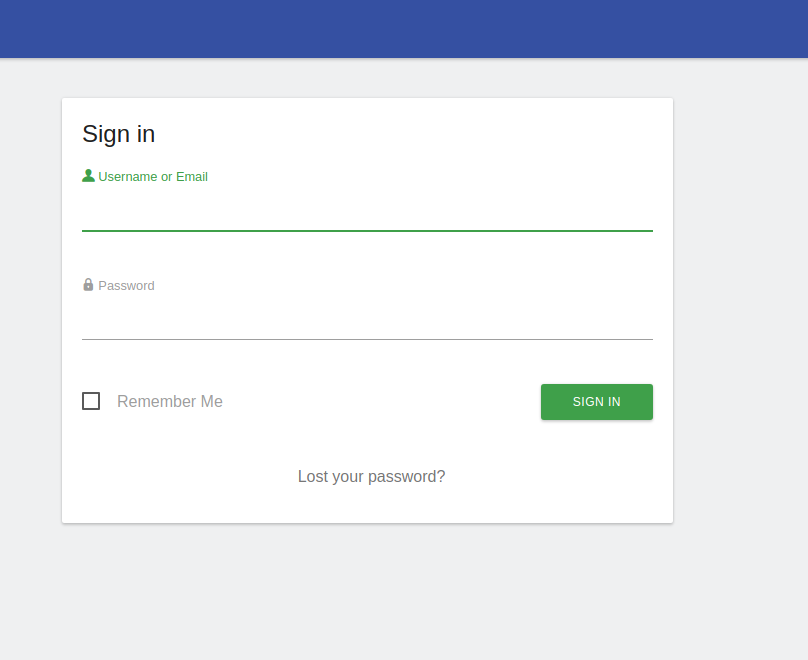

Log in with the admin account you created during setup, and you should be taken to the dashboard.
